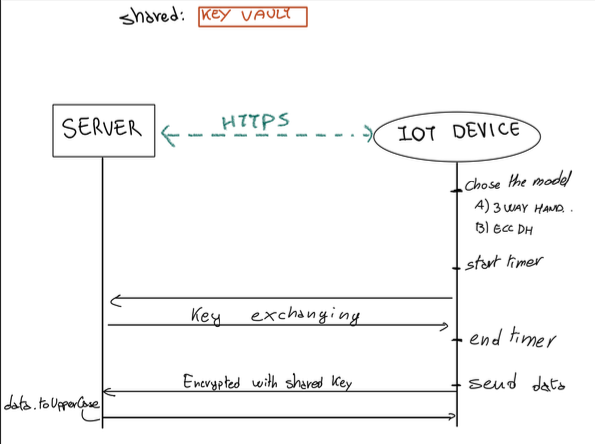
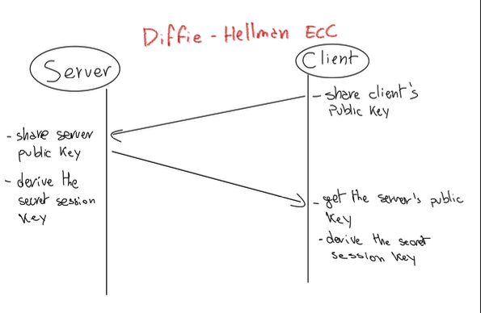

# IoT Authentication - replication project

> Replication of paper - Authentication of IoT Device and IoT Server Using Secure Vaults
- link to the paper: https://ieeexplore.ieee.org/document/8455985

**Author**: Alberto Morini (mat. 2107783)

**Date**: 05/02/2024 

The source code is available on GitHub: https://github.com/albertomorini/IoT_Authentication


<div style="page-break-after: always;"></div>


## Table of content
- [IoT Authentication - replication project](#iot-authentication---replication-project)
  - [Table of content](#table-of-content)
  - [Abstract](#abstract)
    - [Architecture](#architecture)
    - [Technical specification](#technical-specification)
  - [Authentication Mechanism](#authentication-mechanism)
    - [Step 1](#step-1)
    - [Step 2](#step-2)
    - [Step 3](#step-3)
    - [Step 4](#step-4)
  - [ECC-DH](#ecc-dh)
  - [Performance Analysis](#performance-analysis)
  - [Conclusions](#conclusions)
    - [Reference links](#reference-links)


<div style="page-break-after: always;"></div>

## Abstract

For this project it's required to replicate the authentication mechanism used to generate a shared key (paper's section: 4). 

Then, will be analyzed the efficiency in terms of energy consumed (paper's section: 6.A)

### Architecture

The architecture created is standard, composed by server and multiple clients.

Server will implement the HTTPS protocol, using a self-signed certificate.

The packets will have a JSON content-type and in each there will be some metadata used by server.
```JSON
{
  "alg": the cryptography algorithm selected (AES128, AES256, ECC),
  "deviceID": the id of the device,
  "sessionID": the session ID,
  "message": ~data~
}
```

Once the shared key has been generated, client will send a string (secret message) to server that will transform the message in upper case and then resend it back.



*Fig.1 Concept of designed architecture*

In this project has been implemented two method for key exchange: the "3 way handshake" ideated in the paper in replication, and Elliptic Curve with Diffie-Hellman (as a comparison).

For the 3 way handshake, the "secret vault" (set of keys) is generated by another script (`keygen.js`) and stored into a text file, which will be read by client and server and kept as a constant.
<br/>
Furthermore, the encryption can be chosen between AES-128 and AES-256.

Instead for the ECC method, aren't required any initials configurations.


<div style="page-break-after: always;"></div>

### Technical specification

Whole project has been implemented with NodeJS (version 21.6.1).
<br/>
To implement the required functions, have been used standard libraries except for "eccrypto" (available on <a href="https://www.npmjs.com/package/eccrypto">npm</a>) which simplify the usage of Elliptic Curve Cryptography.

> Unluckly eccrypto (version 1.1.6) present a bug which makes the library not usable for distributed systems (our case, where the client encrypt with public key of server), specifically throwing a "public key" exception.

> This problem can be solved by using the encrypt/decrypt functions provided in the <a href="https://github.com/bitchan/eccrypto/issues/75#issuecomment-966437447">issue 75</a> on GitHub.
> And also commenting the assertion on line 190 of "browser.js"


Test and analysis have been made on: Mac Mini M1 (2020) - 8gb of RAM.

<div style="page-break-after: always;"></div>

## Authentication Mechanism

For simplicity, we can divide the authentication mechanism in 4 steps:

### Step 1
In the first step, the IoT device sends a request to the server containing it's own id (device id, unique) and a session id.

### Step 2

Server checks if the "device id" received in the previous step is known and allowed. Then, if it is, will replay back with a challenge (called M2)

$$M2(C1,r1)$$

Where:

- **C1**: is a set of 'p' distinct numbers
  -  and each number is an index in the secure vault (shared/known to both entity)
-  **r1**: is a random number

<div style="page-break-after: always;"></div>


### Step 3

In the third step, client has received the challenge ($M2(C1,r1)$) from the server.

At first, it have to make the xor of every key of index in the C1 set.

`K1 = XOR all key stored in C1`

In formula : $k1 = k[c11] \oplus k[c12] ... \oplus k[c1p]$

Then, client can create its own challenge (called M3), which consists in: 
$$Enc(k1,(r1 || t1 || {C2,r2}))$$


Where

- **Enc**: is an encryption (*eg. AES 256*)
- **k1**: is the key used for encrypted retrieved by the xor of C1
- **r1**: the random number from the `M2` challenge
- **t1**: a random number for session
- **r2**: a random number for the challenge
- **C2**: as C1, index of the shared secure vault

Then, client sent to the server the challenge M3.

> NB: the "||" is the concatenation operation (assumed with a sentinel character, in this replication won't be needed thanks to JSON content-type of packages).

<div style="page-break-after: always;"></div>

### Step 4

At this point, server have received M3, which can be decrypted with key `k1`.

Then, server can retrieve `k2` by making a xor operation of 'C2'. After, can finally generate the last challenge called M4.

$$M4= Enc( k2 \oplus t1 ,(r2 || t2))$$

Where

- **Enc**: is the encryption method
- **$k2 \oplus t1$**: is the xor between k2 and the t1 (random number received in the challenge)
- **r2**: is the random number received in the challenge "M3"
- **t2**: a new random for the challenge "M4"

So, the server will replay the client with the challenge M4, containing 't2' which will be used for another "xor" operation with "t1" to generate the final shared session key.

<div style="page-break-after: always;"></div>

## ECC-DH

As said before, in this project has been implemented also a key-exchange made with Elliptic-curve Diffie–Hellman, thus to compare with the method created in the paper.

In this case, client have to know the "public key" of the server, thus to derive the shared secret key. And vice-versa, the server.


*Fig2. ECC-DH Panoramic flowchart*

To share the public key, is just needed one request.
1. So, the client send the first HTTPS message to the server including it's public key.
2. Server, at this point will response with it's public key, and can already compute the shared key
3. The client as soon as get the response, will retrieve too the shared key 

<div style="page-break-after: always;"></div>

## Performance Analysis

Testing had not been made on IoT device, instead on the same PC which makes the server (due to technical availability and rapidity of development).

Both mechanism have been tested "n" times, thus to compute an average value of the time spent on key exchanging.

In the three way handshake have been implemented two stopwatch one for each step ([First](#step-1) and [Third](#step-3)), they must be summed up together thus to get the total time of key exchange.

Instead, in ECC mode, the firsts tests takes a lot more time then the following ones. This is probably caused by NodeJS bringing the library used ("eccrypto") into the cache, those values will be removed (outliers removing).

The average time is:

- **Paper's authentication with AES128**: 0.4076 ms
- **Paper's authentication with AES256**: 0.3981 ms
- **ECC with outliers**: 8.5564 ms
- **ECC without outliers**:3.0761428571428575 ms

> The full terminal's output is on folder "data"

Notice that the time obtained in the "three way" method is significantly less than what was obtained in the paper, this is clearly due to the difference of the technical specifications (Mac Mini M1 - Arduino).
Curiously ECC method has pretty much the same results.

<div style="page-break-after: always;"></div>


Anyway, in the paper is used an "Analysis of energy consumption" designed in another <a href="https://ieeexplore.ieee.org/abstract/document/1258477">paper</a>, which consists in:

> Their method stipulates that the total energy consumed is the product of average current drawn by the hardware, voltage provided to the hardware and the average time taken by the algorithm to execute

So in this case Mac Mini M1 has a line voltage between 100 and 240V (AC), and at max CPU usage use 39,9 Watt with 6,9 in IDLE.
So, assuming a voltage of 220V and an average of 16 Watt, we have:

$16/220 * 100= 2,27\  mA$

Then:


| Algorithm           | Average time | Energy Consumed |
| ------------------- | ------------ | --------------- |
| AES128              | 0.4076 ms    | 203.55 µJ       |
| AES256              | 0.3981 ms    | 198.81 µJ       |
| ECCDH (w/ outliers) | 8.5564 ms    | 4273.06 µJ      |
| ECCDH               | 3.0761 ms    | 1536.20 µJ      |

<div style="page-break-after: always;"></div>


## Conclusions

In conclusion, some critical thought about the system created.

- Using an external library for ECC method could increase the complexity and then require more time on key exchanging. 
- The method ideated in the paper as shown by the data, is more efficiency and solid enough. But, require a known and pre-shared secret vault, which represent an asset to protect.

As said on the previous section, the algorithms have been tested several time (exactly 10 times) thus to be able to gain an average value.


### Reference links

- Mac Mini consumption 
  - https://support.apple.com/kb/SP823?locale=en_US
  - https://support.apple.com/en-us/103253
- NodeJS: https://nodejs.org/en
  - Eccrypto library: https://www.npmjs.com/package/eccrypto
- Paper in replication: https://ieeexplore.ieee.org/document/8455985
  - Paper for analysis consumption: https://ieeexplore.ieee.org/abstract/document/1258477